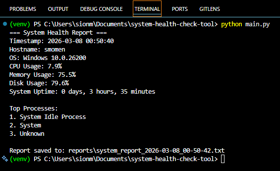

# System Health Check Automation Tool

A Python-based automation tool that collects key system health information and generates a readable report for troubleshooting and routine system checks.

The tool gathers information such as CPU usage, memory usage, disk usage, and system uptime, then outputs a structured report in both the terminal and a saved text file.

---

## Features

• Collects system information including hostname and operating system  
• Reports CPU, memory and disk usage  
• Calculates system uptime
• Generates timestamped system health reports  
• Saves reports automatically to a `/reports` directory  

---

## Technologies Used

Python  
psutil (system monitoring library)  
platform  
socket  

---

## Example Output

A sample report is also included:
reports/sample_report.txt

---

## How to Run

1. Clone the repository:
git clone https://github.com/SionMontaque/system-health-check-tool.git

2. Navigate into the project folder:
cd system-health-check-tool

3. Install dependencies:
pip install -r requirements.txt

4. Run the program:
python main.py

---

## Why I Built This

I built this project to strengthen my Python automation and system monitoring skills by creating a practical tool that gathers system health information and generates structured reports. The goal was to build a simple, maintainable script that demonstrates scripting, debugging and modular code organisation.

